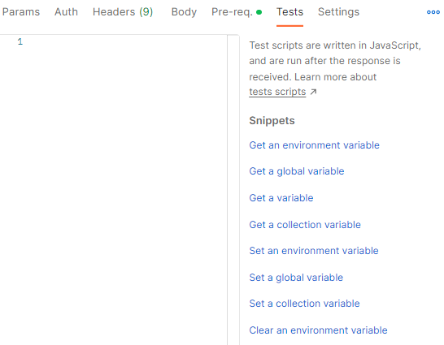

<h4 align="center">Pildora sobre como utilizar Postman y Newman.</h4>

<p align="center">
  
  
  
<p>

<p align="center">
  <a href="#propósito">Propósito</a> •
  <a href="#entorno">Entorno</a> •
  <a href="#download">Postman</a> •
  <a href="#credits">Newman</a> •
  <a href="#license">License</a>
</p>

<hr>

# Propósito

El propósito de la píldora es el de intentar establecer una base para poder utilizar eficázmente Postman y Newman de forma conjunta o separada.

# Entorno


El entorno de pruebas está basado en la popular **PetStore** que estará montada sobre Docker, el cual permite crear todas las instancias necesarias de la PetStore variando únicamente el puerto de conexión.

Se puede utilizar tanto **[Docker Desktop]** como **[Rancher]**.

<br>

### Crear contenedores

```bash
# Crear petstore en puerto 88
$ docker run -d --name petstore1 -e SWAGGER_HOST=http://petstore.swagger.io -e SWAGGER_URL=http://localhost -e SWAGGER_BASE_PATH=/v2 -p 88:8080 swaggerapi/petstore

# Crear petstore en puerto 8088
$ docker run -d --name petstore1 -e SWAGGER_HOST=http://petstore.swagger.io -e SWAGGER_URL=http://localhost -e SWAGGER_BASE_PATH=/v2 -p 8088:8080 swaggerapi/petstore
```
<br>

> **Parámetros**
> * `-d` indica que el contenedor se ejecutará en segundo plano liberando la consola
> * `--name` indicará el nombre del contenedor. Tiene que ser único
> * `-e` especifica las variables de entorno que se utilizará el contenedor.
> * `-p 88:8080` especifica el puerto_externo:puerto_interno. En este caso podremos acceder a PetStore mediante la url `http://localhost:88`

<br>


<br>

Una vez creados los contenedores podremos comprobar que se han creado con éxito si abrimos la URL `http://localhost:88`


<br>

> **Nota**
> Para que muestre el contenido del Swagger hay que indicar el puerto correctamente en la caja superior, en caso contrario irá a buscar la url al puerto 80 en lugar del 88

<br>

#  Postman

## Colecciones
Una colección es un conjunto de carpetas y requests. Las carpetas pueden contener scripts que se lanzarían antes de las requests y tests adicionales.

### Crear Requests
Para crear una request sencilla, bastará con seguir estos pasos:
* Pulsar sobre el icono de los tres puntos de la colección y luego **Add Requests**


* Definir un nombre, una acción y la dirección URL del endpoint


## Entornos

Los entornos se usan para definir diferentes URL para un mismo servicio según el ambiente (PRE, PRO...) de forma que una misma request pueda ser ejecutada en varios ambientes sin hacer cambios.

Para crear un nuevo ambiente pulsamos en **New**, en la ventana que aparece seleccionamos **Environment**


<br><br>
Una vez creado hay que definir los endpoints que contendrá. En este caso se define una variable *port* que contendrá el puerto del endpoint y otra variable llamada *baseUrl* que contendrá la URL utilizando la variable port.


<br><br>
Para que la request pueda hacer uso de las variables definidas en el entorno habrá que llamar a *baseUrl*


## Autenticación

## Variables Globales y de Colección

Las variables se pueden utilizar para reutilizar llamadas, payloads, tests... Se pueden definir en las Colecciones y en los Environments.

Para utilizar una variable se la llamará utilizando doble llave y el nombre: **{{nombre_variable}}**
## Tests
Los tests son pequeños scripts que se ejecutan para realizar validaciones sobre la respuesta obtenida en la request.
Un test muy sencillo podría ser comprobar que el código devuelto por el servidor es **200 OK**, o comprobar que un valor Json es correcto

Para definir un Test basta con abrir la pestaña Test de la Colección, Carpeta o Request individual. En ella escribiremos el código que se utilizará para validar la respuesta.
Postman ofrece una serie de snippets comunes que se pueden utilizar diréctamente.



<br>
Ejemplo de código para un test que verifica que el status de la respuesta es 200:
```javascript
pm.test("Status code is 200", function () {
    pm.response.to.have.status(200);
});
```

## Runner
Para facilitar la tarea de ejecutar varias request, Postman tiene una herramienta llamada Runner. En ella podremos decidir que requests queremos ejecutar, el número de iteraciones, el retardo entre ellas, etc... 

Para ello abrimos la colección o carpeta y seleccionamos Run Collection o Run folder según corresponda


Pantalla de runner donde podremos alterar el orden de las request, cuales deben ser ejecutadas, el número de iteraciones, delay, fichero de datos, etc...


### Uso de fichero CSV
Se puede definir un fichero CSV para que los datos que contiene sean utilizados por las request que se van a ejecutar.
Para ello hay que seleccionar el fichero CSV en la pantalla de configuración del Runner y llamar a los valores allí donde se necesiten mediante ```data.FIELDNAME```

#### Ejemplo de uso:
Para automatizar el envío de una serie de request muy similares en las que únicamente cambia una parte de la URL y el valor a asignar se ha optado por utilizar un fichero CSV.

La URL a consultar es ```http://httpstat.us/VALOR``` donde ```VALOR``` es lo que obtendremos del fichero CSV. El contenido de dicho fichero será el siguiente:
```csv
VALOR
200
204
400
403
404
```
Ahora habrá que crear la colección y la request para la prueba.
Como hay que utilizar el contenido del fichero CSV en la URL de la request, habrá que leer dicho valor previamente utilizando un **Pre-request Script**, que son scripts que se lanzan antes de cada request.
En esta sección crearemos un script que asigne el valor del CSV a una variable de colección y que podrá ser utilizada por todo lo que contiene.

Para crear esa variable, dentro de la colección hay una pestaña llamada **Variables**, en ella definiremos nuestra variable y grabamos

En la pestaña **Pre-request Script** escribiremos un pequeño script que asignará el valor de la columna del CSV a la variable
```javascript
pm.collectionVariables.set("miValor", "data.VALOR");
```
> Este código lo ofrece diréctamente Postman como snippet


Ahora hay que crear una request dentro de la colección y usaremos la variable creada en la URL y en el test de validación. Excepto para los tests, si se quiere utilizar una variable habrá que invocarla usando su nombre entre llaves ```{{nombre_variable}}```


Si ahora ejecutamos esa requests fallará debido a que la variable no tiene asignado ningún valor, si le asignamos un valor a mano (por ejemplo 200) y lanzamos la request, veremos como se ejecuta y valida correctamente.


## Exportar


#  Newman

## Instalación
Ejecutar el comando nodeJS ```npm install -g newman```

## Ejecutar colecciones
Lanzar comando ```newman run .\PetStore_Newman.postman_collection.json -e '.\Puerto_8x.postman_environment.json'```


Para iteraciones con CSV ``` newman run .\PetStore_Newman_CSV.postman_collection.json -e '.\Puerto_8x.postman_environment.json' -d .\datos.csv```


## Link
* https://learning.postman.com/docs/running-collections/using-newman-cli/installing-running-newman/


[Docker Desktop]:https://www.docker.com/products/docker-desktop/
[Rancher ]:      https://rancherdesktop.io/

[GitHub action]: https://github.com/andresz1/size-limit-action
[Statoscope]:    https://github.com/statoscope/statoscope
[cult-img]:      http://cultofmartians.com/assets/badges/badge.svg
[cult]:          http://cultofmartians.com/tasks/size-limit-config.html